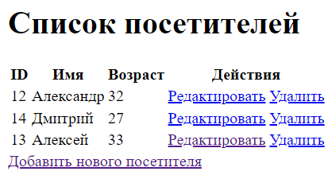

##irlix_storage

Проект включает в себя решения задач, разработанных для стажировки, 
и предназначен для практического обучения и развития навыков.

В данном репозитории прорабатываются темы:

+ Hibernate-validator;
+ FreeMaker;
+ Java JDBC;
+ Spring JDBC;
+ HIBERNATE.

###Репозиторий содержит следующие проекты:

1) Проект для учета посетителей, в котором реализованы все операции CRUD
с использованием FreeMarker для генерации динамических HTML шаблонов.

Описание будет пополняться по мере выполнения задач.